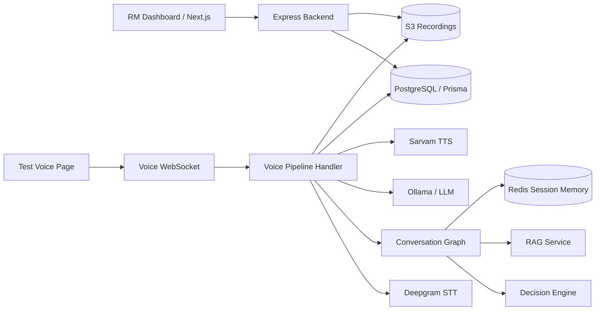

# Rupeezy AI Voice Agent Architecture

This document explains the whole system in plain language: what each part does, how data moves through it, where calls and recordings are stored, and how the RM dashboard reads everything back.

## 1. What This System Does

The application is an AI voice agent for Rupeezy partner lead conversion.

It has two main user-facing experiences:

1. RM dashboard
   - Add leads manually or in bulk.
   - View lead status, score, call history, transcripts, summaries, and recordings.
   - Identify HOT/WARM/COLD leads for follow-up.

2. AI voice call pipeline
   - Starts a voice conversation with a lead.
   - Listens to the user through Deepgram STT.
   - Uses LLM + LangGraph-style state to decide what to say.
   - Speaks through Sarvam TTS.
   - Stores transcript, summary, score, and audio chunks per call.

## 2. High-Level Architecture



## 3. Main Applications

### Backend

Location: `apps/backend`

Runtime:
- Express HTTP API
- WebSocket server
- Prisma ORM
- PostgreSQL database
- Redis for short-lived session memory
- S3 for audio recordings

Important entry point:
- `apps/backend/src/index.ts`

This file:
- Starts Express.
- Registers RM dashboard APIs under `/api/rm`.
- Registers conversation APIs under `/api/conversations`.
- Registers WebSocket upgrade routes:
  - `/ws/voice`
  - `/ws/test-voice`
  - `/ws/voice-pipeline`

### RM Dashboard

Location: `apps/rm-dashboard`

Runtime:
- Next.js frontend
- Talks to backend using `NEXT_PUBLIC_API_URL` or `http://localhost:4000`.

Important files:
- `app/page.tsx`: overview dashboard
- `app/leads/page.tsx`: lead list
- `app/leads/[id]/page.tsx`: lead detail, call history, transcript, recordings
- `lib/api.ts`: frontend API client
- `lib/types.ts`: frontend types

## 4. Database Model

Defined in: `apps/backend/prisma/schema.prisma`

### Lead

One row per lead.

Important fields:
- `id`: internal lead id
- `phone`: unique phone number
- `name`
- `language`
- `background`
- `occupation`
- `score`
- `status`: `HOT`, `WARM`, or `COLD`
- `callScript`: optional custom opening script
- `calls`: all calls for this lead

### Call

One row per call attempt.

This is what allows multiple calls per lead.

Important fields:
- `id`: conversation/call id
- `leadId`: points to the lead
- `transcript`: JSON array of messages
- `summary`: JSON summary and extra metadata
- `score`
- `duration`
- `language`
- `recordingUrl`: first/main recording S3 key
- `recordingSize`
- `startedAt`
- `endedAt`

### WhatsappLog

Stores mocked WhatsApp follow-up logs.

## 5. Backend API Structure

### RM APIs

Files:
- `apps/backend/src/modules/rm_dashbaord/lead.routes.ts`
- `apps/backend/src/modules/rm_dashbaord/lead.controller.ts`
- `apps/backend/src/modules/rm_dashbaord/lead.service.ts`
- `apps/backend/src/modules/rm_dashbaord/lead.repository.ts`

Routes:

```text
GET  /api/rm/analytics
GET  /api/rm/leads
POST /api/rm/leads
POST /api/rm/leads/upload
GET  /api/rm/leads/:id
GET  /api/rm/calls/:callId/audio-chunks
```

Key behavior:
- `GET /api/rm/leads/:id` returns one lead plus all calls for that lead.
- Calls are ordered newest first.
- Each call has its own summary and recording metadata.
- `GET /api/rm/calls/:callId/audio-chunks` returns signed S3 URLs for the call recording chunks in sequence.

### Conversation APIs

File:
- `apps/backend/src/services/conversation/conversationRoutes.ts`

Routes:

```text
GET /api/conversations/:conversationId
GET /api/conversations/lead/:leadId
GET /api/conversations/:conversationId/recording
```

Key behavior:
- Fetch a single call with transcript, summary, and recording chunks.
- Fetch all conversations for one lead.
- Generate signed S3 URLs on demand.

## 6. Voice Call Flow

Main file:
- `apps/backend/src/services/conversation/voicePipelineHandler.ts`

The frontend/test page connects to:

```text
ws://localhost:4000/ws/voice-pipeline
```

### WebSocket Protocol

Client sends:

```text
START_CALL
AUDIO_CHUNK
END_TURN
END_CALL
```

Server sends:

```text
GREETING
TRANSCRIPT
AUDIO_PLAY
TURN_DONE
HANDOFF_REQUIRED
CALL_ENDING
CALL_ENDED
ERROR
```

### Call Startup

When `START_CALL` is received:

1. Backend resolves the real lead id.
2. Backend creates a new `Call` row.
3. Backend fetches previous completed call context for the same lead.
4. Backend builds initial conversation state.
5. Conversation graph creates the greeting.
6. Greeting is stored in transcript.
7. Greeting audio is generated and sent to the client.

Important files:
- `conversationStorage.ts`: creates call row and fetches previous context
- `conversationGraph.ts`: builds opening greeting
- `sarvamTTS.ts`: generates audio

## 7. Multiple Calls Per Lead

The system supports multiple calls per lead by design.

Database shape:

```text
Lead
  Call 1
  Call 2
  Call 3
```

Each call stores separately:
- transcript
- summary
- score
- duration
- language
- recording chunks
- start/end timestamps

The lead stores the latest aggregate state:
- current score
- current HOT/WARM/COLD status
- latest known language/background/name updates

### Previous-Call Memory

When a lead is called again, the new call receives compact context from the latest completed previous call:

- previous call date
- previous score/status
- key points
- objections
- stated intent
- next action

This context is attached to:

```ts
leadProfile.previousConversation
```

It is used in:
- opening greeting
- LLM system prompt

Example repeat-call opening:

```text
नमस्ते Rahul जी, मैं Priya Rupeezy से।
7 May 2026 को हमारी बात brokerage share के बारे में हुई थी।
क्या अभी उसी discussion को continue कर सकते हैं?
```

## 8. Conversation Graph

Main file:
- `apps/backend/src/services/conversation/conversationGraph.ts`

The graph manages conversation state and the high-level flow.

Important state fields:
- `lead_id`
- `conversation_id`
- `call_stage`
- `stage`
- `intent`
- `emotion`
- `is_objection`
- `active_objection`
- `objections_raised`
- `history`
- `response`
- `score`
- `engagement_level`
- `handoff`
- `should_continue`
- `lead_profile`

### Stages

```text
greeting
pitch
objection_handling
qualification
closing
ended
```

### Graph Nodes

```text
opening
parallelPrepare
generate
guardrailsScoring
tts
```

The live WebSocket path uses:
- full graph for opening
- prep graph for turn preparation
- custom streaming response generation in `voicePipelineHandler.ts`

## 9. Decision Engine

File:
- `apps/backend/src/services/conversation/decisionEngine.ts`

Purpose:
- Classify the user turn.
- Detect objections.
- Detect emotion.
- Detect intent.
- Decide next stage.

Detected objection types:

```text
already_with_broker
not_enough_contacts
client_support_concern
trust_concern
defer_decision
none
```

It uses:
- fast LLM JSON classification
- fallback keyword classifier if LLM fails

Fallback is important because voice pipelines must continue even when the LLM gives bad JSON or times out.

## 10. Prompt Building

File:
- `apps/backend/src/services/conversation/promptBuilder.ts`

Purpose:
- Builds the system prompt for Priya.
- Injects:
  - stage instructions
  - language rules
  - lead profile
  - previous call context
  - score and objections
  - RAG knowledge
  - response rules
  - TTS style guidance

TTS style rules tell the LLM to:
- keep sentences short
- use commas and sentence endings
- write Hindi/Hinglish in Devanagari for Hindi words
- keep business terms in English

## 11. Speech-to-Text

File:
- `apps/backend/src/services/stt/deepgramService.ts`

Purpose:
- Streams browser mic audio to Deepgram.
- Emits partial/final transcripts.
- Triggers turn processing when speech is final.

The voice pipeline buffers user audio chunks for two purposes:

1. STT processing
2. recording upload per user turn

## 12. Text-to-Speech

File:
- `apps/backend/src/services/tts/sarvamTTS.ts`

Purpose:
- Prepare text for TTS.
- Detect target language.
- Call Sarvam TTS.
- Return decoded audio bytes as `Buffer`.

### TTS Text Preparation

`prepareTextForTTS()`:
- removes think tags
- removes markdown markers
- normalizes whitespace
- formats long numbers with Indian commas
- normalizes punctuation
- adds sentence-ending punctuation if missing

### Dynamic Pace and Temperature

`resolveTTSStyle()` changes voice delivery based on conversation state:

```text
greeting             slower/warm
pitch                slightly brisk
objection_handling   slower/calmer
confused/negative    slowest and controlled
positive_interest    warmer/more expressive
closing              steady and professional
```

Defaults can be overridden:

```env
SARVAM_TTS_MODEL=bulbul:v3
SARVAM_TTS_SPEAKER_HI=priya
SARVAM_TTS_SPEAKER_EN=ishita
SARVAM_TTS_PACE=1.0
SARVAM_TTS_TEMPERATURE=0.6
```

## 13. LLM Layer

File:
- `apps/backend/src/services/llm/llmService.ts`

Purpose:
- Calls Ollama chat models.
- Supports:
  - normal response generation
  - simple replies
  - streaming chat replies

Main models are configured through env:

```env
OLLAMA_BASE_URL=...
OLLAMA_MODEL=...
OLLAMA_MODEL_FAST=...
```

## 14. RAG

File:
- `apps/backend/src/services/rag/ragService.ts`

Purpose:
- Retrieves relevant knowledge chunks for objections, pitch, and qualification.
- Helps Priya avoid fabricating details and answer consistently.

The graph fetches RAG context in parallel with:
- decision engine
- Redis history

## 15. Guardrails

File:
- `apps/backend/src/services/guardrails/guardrailsService.ts`

Purpose:
- Check whether user input is relevant to Rupeezy/financial services.
- Avoid responding deeply to unrelated inputs.

The graph also applies output cleanup in `guardrailsScoringNode()`:
- trims overly long responses
- replaces risky wording like guaranteed/risk-free
- ensures a fallback response exists

## 16. Scoring

File:
- `apps/backend/src/services/scoring/scoringEngine.ts`

Purpose:
- Convert conversation signals into a score.
- Map score to lead status.

Signals include:
- enthusiasm
- follow-up questions
- positive affirmation
- objection raised
- objection resolved
- stated intent
- call duration
- whether the lead stayed through pitch

Status mapping:

```text
HOT   score >= 75
WARM  score >= 45
COLD  score < 45
```

## 17. Transcript Storage

File:
- `apps/backend/src/services/conversation/conversationStorage.ts`

Each transcript message has:

```ts
{
  role: 'user' | 'assistant',
  content: string,
  timestamp: number,
  language?: string,
  intent?: string,
  emotion?: string,
  score?: number
}
```

Important detail:
- Transcript append uses an atomic PostgreSQL JSONB append.
- This avoids lost messages when user and assistant saves happen close together.

## 18. Call Summary

File:
- `apps/backend/src/services/conversation/callSummary.ts`

Generated at call end.

Stored in:

```text
Call.summary
```

Important fields:
- leadName
- language
- durationSeconds
- finalScore
- status
- totalTurns
- engagementLevel
- keyPoints
- objectionsRaised
- objectionsResolved
- statedIntent
- rmOpener
- nextAction
- whatsappMessage
- handoffOccurred
- handoffReason
- endReason

The summary is also extended with:

```text
recordingChunks
```

## 19. Recording Architecture

Recordings are stored in S3.

Main files:
- `apps/backend/src/services/storage/s3Service.ts`
- `apps/backend/src/services/conversation/conversationStorage.ts`
- `apps/backend/src/services/conversation/voicePipelineHandler.ts`

### Recording Per Call

Each call gets its own folder:

```text
recordings/{conversationId}/
```

### Recording Chunks

Each speaker turn is uploaded in sequence:

```text
recordings/{conversationId}/recording1.mp3   agent greeting
recordings/{conversationId}/recording2.webm  user reply
recordings/{conversationId}/recording3.mp3   agent response
recordings/{conversationId}/recording4.webm  user reply
```

Chunk metadata is stored in `Call.summary.recordingChunks`:

```ts
{
  index: number,
  key: string,
  sizeBytes: number,
  mimeType: string,
  speaker: 'agent' | 'user',
  text?: string,
  timestamp?: number
}
```

The backend returns signed URLs to the frontend. Raw S3 keys are not directly exposed as public files.

## 20. Redis Memory

Files:
- `apps/backend/src/services/memory/sessionStore.ts`
- `docker-compose.yml`

Redis stores short-lived per-call memory:

```text
session:{conversationId}
summary:{conversationId}
context:{conversationId}
```

Purpose:
- Keep recent turn history during a live call.
- Summarize older history when it grows.
- Reduce prompt size.

Redis is not the permanent source of truth. PostgreSQL is.

## 21. S3 Storage

File:
- `apps/backend/src/services/storage/s3Service.ts`

Purpose:
- Upload full recordings or chunks.
- Generate signed URLs for playback.

Required env:

```env
AWS_REGION=...
AWS_ACCESS_KEY_ID=...
AWS_SECRET_ACCESS_KEY=...
AWS_BUCKET_NAME=...
```

## 22. Dashboard Data Flow

### Lead list

```text
Dashboard -> GET /api/rm/leads -> PostgreSQL Lead rows
```

### Lead detail

```text
Dashboard -> GET /api/rm/leads/:id
Backend -> Lead + calls + recording metadata
Dashboard -> user selects call
Dashboard -> GET /api/conversations/:conversationId
Backend -> transcript + summary + signed recording chunks
```

### Recording playback

```text
Dashboard -> receives signed S3 URLs
Browser audio tag -> plays each chunk
```

## 23. Environment Variables

Important backend env values:

```env
PORT=4000
DATABASE_URL=...
DIRECT_URL=...

OLLAMA_BASE_URL=...
OLLAMA_MODEL=...
OLLAMA_MODEL_FAST=...

SARVAM_API_KEY=...
SARVAM_TTS_MODEL=bulbul:v3
SARVAM_TTS_SPEAKER_HI=priya
SARVAM_TTS_SPEAKER_EN=ishita
SARVAM_TTS_PACE=1.0
SARVAM_TTS_TEMPERATURE=0.6

AWS_REGION=...
AWS_ACCESS_KEY_ID=...
AWS_SECRET_ACCESS_KEY=...
AWS_BUCKET_NAME=...
```

Frontend:

```env
NEXT_PUBLIC_API_URL=http://localhost:4000
```

## 24. Local Development

Start Redis:

```bash
docker compose up -d redis
```

Backend:

```bash
cd apps/backend
npm install
npm run dev
```

Dashboard:

```bash
cd apps/rm-dashboard
npm install
npm run dev
```

Build backend:

```bash
cd apps/backend
npm run build
```

## 25. Key Design Decisions

### One lead, many calls

A lead is the person/business contact. A call is one conversation attempt. This keeps repeated calls clean and prevents transcripts from mixing.

### Call id is the conversation id

The WebSocket call id and database `Call.id` are the same. This makes transcript, summary, and recordings easy to join.

### Recording chunks are per turn

The system does not try to merge browser WebM audio and agent MP3 audio into one file. Instead, it stores ordered chunks. This is simpler, reliable, and preserves speaker sequence.

### Previous call context is compact

The system does not inject entire old transcripts into new calls. It injects a compact summary from the latest completed call. This keeps prompts smaller and avoids repetition.

### PostgreSQL is permanent memory

Redis is used for live-call working memory. PostgreSQL stores the durable source of truth.

## 26. Common Debug Checklist

### Dashboard shows no leads

Check:
- backend running
- `DATABASE_URL`
- `/api/rm/leads`
- whether leads exist in DB

### Call starts but transcript is empty

Check:
- Deepgram key/config
- browser mic permission
- WebSocket `/ws/voice-pipeline`
- logs from `deepgramService.ts`

### Agent speaks but recording missing

Check:
- `AWS_BUCKET_NAME`
- AWS credentials
- `uploadCallAudioChunks()`
- `Call.summary.recordingChunks`

### Repeat call does not reference previous call

Check:
- previous call has `endedAt`
- previous call belongs to same `leadId`
- previous call has summary data
- `getPreviousConversationContext()`

### TTS sounds unnatural

Check:
- prompt output language/script
- `prepareTextForTTS()`
- Sarvam speaker config
- dynamic pace/temperature

## 27. Important Files Map

```text
apps/backend/src/index.ts
  Express + WebSocket entrypoint

apps/backend/src/modules/rm_dashbaord/
  RM APIs for leads, analytics, call chunks

apps/backend/src/services/conversation/voicePipelineHandler.ts
  Main live voice WebSocket handler

apps/backend/src/services/conversation/conversationGraph.ts
  Conversation state machine

apps/backend/src/services/conversation/decisionEngine.ts
  Intent, emotion, objection, stage decision

apps/backend/src/services/conversation/promptBuilder.ts
  LLM system prompt

apps/backend/src/services/conversation/conversationStorage.ts
  Call/lead persistence, transcript append, summaries, recording metadata

apps/backend/src/services/conversation/callSummary.ts
  Final call summary generation

apps/backend/src/services/tts/sarvamTTS.ts
  Sarvam TTS integration and dynamic voice parameters

apps/backend/src/services/stt/deepgramService.ts
  Deepgram STT integration

apps/backend/src/services/storage/s3Service.ts
  S3 upload and signed URL generation

apps/backend/src/services/memory/sessionStore.ts
  Redis session memory

apps/rm-dashboard/app/
  Next.js pages

apps/rm-dashboard/components/
  UI components

apps/rm-dashboard/lib/api.ts
  Frontend API client
```

